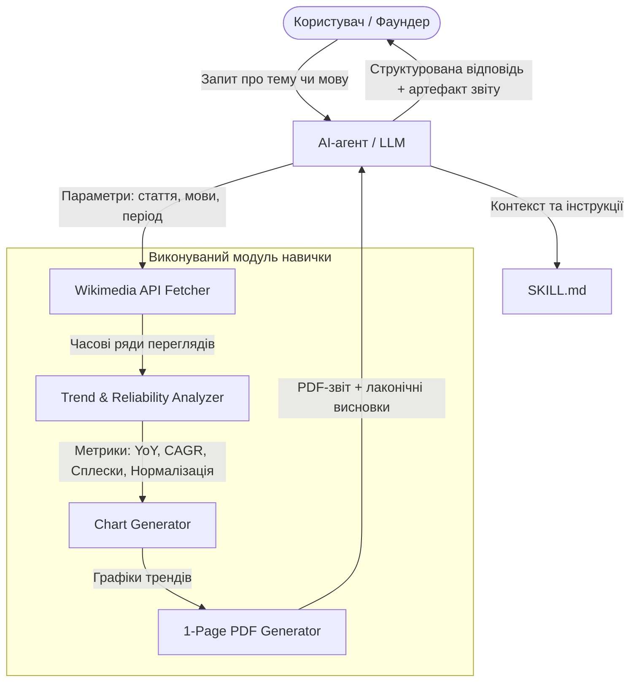
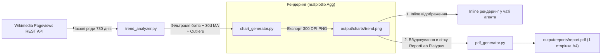

# AI Product Engineering School // Case: Wikipedia Trend Analysis Agent Skill

> **Розробка автономної навички (Agent Skill) для дослідження ринкових трендів і валідації попиту на базі статистики переглядів Wikipedia.**

---

## 📌 Про проєкт

Командам B2C-продуктів (EdTech, Health & Fitness, мовні застосунки тощо) постійно доводиться ухвалювати рішення щодо пріоритетів розвитку:
- Чи варто додавати новий тематичний курс у застосунок?
- У які нові географічні/мовні ринки інвестувати ресурси для локалізації?
- Чи є інтерес до певної теми стійким трендом, чи це короткочасний спалах уваги через новини?

Даний проєкт реалізує **Agent Skill** для AI-агентів, що дозволяє продуктовим лідерам і фаундерам отримувати аналітику на основі реальних даних переглядів статей **Wikimedia**, візуалізувати динаміку попиту та автоматично генерувати лаконічні PDF-звіти (One-pager).

---

## 🎯 Цілі та задачі кейсу

1. **Самостійна навичка (Agent Skill):** створення повноцінної навички відповідно до стандарту Agent Skills, що включає інструкції `SKILL.md` та власний виконуваний код.
2. **Робота з Wikimedia REST API:** автоматизований збір переглядів цільових статей різними мовами за потрібні часові інтервали.
3. **Аналітика та валідація трендів:**
   - Розрахунок динаміки інтересу (YoY, MoM, темпи приросту).
   - Детекція аномальних спалахів (новостий шум vs сталий органічний інтерес).
   - Нормалізація та порівняння між різними мовними розділами.
4. **Візуалізація та генерація звіту:** побудова графіків динаміки та автоматичний експорт 1-сторінкового PDF-звіту з ключовими інсайтами й рекомендаціями.
5. **Оптимізація під швидкі/недорогі LLM:** забезпечення безперебійної роботи агента навіть на моделях класу **Claude Haiku 4.5** чи аналогах (компактні формати передачі даних, надійні інструменти, стійкість до помилок).

---

## 🗂 Структура репозиторію

```text
.
├── README.md                      # Опис проєкту, концепції та інструкції з запуску
├── docs/
│   ├── adr/                       # Architecture Decision Records (реєстр архітектурних рішень)
│   │   ├── README.md              # Індекс та опис прийнятих рішень
│   │   ├── 0001-agent-skill-cli-architecture.md
│   │   ├── 0002-cross-language-entity-resolution.md
│   │   ├── 0003-trend-metrics-and-reliability-score.md
│   │   └── 0004-pdf-report-generation-stack.md
│   └── task/                      # Завдання, планування та вимоги кейсу
│       ├── pes_task_1.md          # Вихідне формулювання завдання (першоджерело)
│       ├── task.md                # Структурований опис завдання
│       └── plan.md                # Детальний аналіз та покроковий план реалізації
├── skills/
│   └── wikipedia-trend-analyzer/  # Реалізація навички аналізу трендів Wikipedia
│       ├── SKILL.md               # Системний опис навички для LLM-агента
│       ├── run.py                 # CLI-оркестратор для виклику агентом
│       ├── scripts/               # Виконуваний код навички (інструменти)
│       │   ├── fetch_views.py     # Збір статистики через Wikimedia API
│       │   ├── analyze.py         # Аналіз динаміки, розрахунок метрик та надійності
│       │   ├── chart_generator.py # Побудова чартів і збереження графіків (PNG)
│       │   └── generate_pdf.py    # Рендеринг 1-сторінкового PDF-звіту
│       ├── requirements.txt       # Залежності середовища
│       └── examples/              # Приклади сформованих звітів і графіків
```

---

## 💡 Приклади користувацьких запитів

- **Оцінка ніші здоров'я:**  
  *«Порівняй зростання інтересу до інтервального голодування в польськомовній та чеськомовній Wikipedia за останні два роки.»*
- **Валідація нового курсу:**  
  *«Ми думаємо додати курс з астрономії до освітнього застосунку. Чи зростає інтерес до цієї теми в україномовній Wikipedia, і наскільки цьому зростанню можна довіряти?»*
- **Пріоритетизація локалізації:**  
  *«Ми створюємо застосунок для вивчення мов. Порівняй інтерес до вивчення англійської у вибраних мовних розділах та підготуй короткий звіт: які аудиторії варто дослідити наступними й чому?»*

---

## ⚙️ Архітектура та принцип роботи навички



### Ключові етапи обробки:
1. **Ідентифікація сутностей:** знаходження відповідних назв статей для потрібних мовних розділів (з використанням Wikidata ID для крос-мовного зіставлення).
2. **Отримання часових рядів:** запит до `wikimedia.org/api/rest_v1/metrics/pageviews/per-article/`.
3. **Очищення та аналітика:**
   - Фільтрація спайків (медіанне згладжування, 30-денні ковзні середні).
   - Оцінка стабільності тренду (коефіцієнт варіації, сезонні патерни).
4. **Генерація артефактів:** створення візуального графіка динаміки та компактного PDF-звіту для презентації команді.

---

## 📊 Візуалізація та графіки: як це працює і де їх бачити

Візуальний аналіз динаміки переглядів є ключовим інструментом для швидкої перевірки продуктових гіпотез. Система генерує графіки детерміновано та надає їх користувачу в кількох зручних каналах:

### 1. Де відображаються графіки (Канали виводу)

| Канал відображення | Формат і розташування | Як це працює і для чого використовується |
| :--- | :--- | :--- |
| **1. Inline прямо у чаті агента** | `output/charts/<topic>_<langs>.png` (300 DPI) | **Миттєвий перегляд:** Агент у своїй текстовій відповіді формує Markdown-посилання ``. Сучасні інтерфейси (Cursor, Claude, Antigravity, VS Code, веб-клієнти) автоматично рендерять зображення інлайн у вікні діалогу без потреби завантажувати сторонні файли. |
| **2. Усередині 1-сторінкового PDF-звіту** | `output/reports/report_<topic>.pdf` (A4 One-pager) | **Офіційний артефакт для команди:** Графік вбудовано у фіксовану сітку по центру сторінки між блоком KPI (Total views, YoY, Reliability) та блоком продуктових висновків. Ідеально підходить для надсилання в Slack, прикріплення до тасок або презентації стейкхолдерам. |
| **3. Локальний артефакт / Інтерактивний перегляд** | `output/charts/` (`.png` або `.html`) | **Глибокий аналіз:** Збережений графік високої роздільної здатності можна відкрити в будь-якому переглядачі зображень або згенерувати інтерактивний HTML-графік для детального зуму та аналізу точних значень при наведенні курсору. |

---

### 2. Що зображено на графіку та як читати дані

Графік спроєктовано за стандартами продуктової аналітики, щоб наочно відокремлювати стійкий ринковий інтерес від шуму:

- 📈 **Плавна крива 30-денного тренду (30-day Moving Average):**  
  Товсті кольорові лінії для кожної мовної версії (наприклад, синя для `pl`, помаранчева для `cs`). Вони фільтрують щоденний шум і спади у вихідні дні, чітко показуючи напрям і темп розвитку ринку.
- 🌫 **Напівпрозорі щоденні значення (Raw Daily Views):**  
  Світлі тонкі лінії на фоні, які відображають реальну амплітуду щоденних коливань.
- 🔴 **Маркери аномальних спалахів (News Spikes / Outliers):**  
  Акцентні точки на піках, де денна кількість переглядів перевищила статистичний поріг аномалії ($Q3 + 1.5 \times \text{IQR}$). Це дозволяє з першого погляду зрозуміти: чи було зростання результатом реального попиту, чи короткочасного новинного хайпу.
- 🏷 **Легенда та шкали:**  
  Відображення точних назв статей у відповідних мовних розділах Вікіпедії, дати на осі X та читабельні скорочення чисел (k, M) на осі Y.

---

### 3. Технічний пайплайн генерації візуалізацій



1. **`matplotlib` + `seaborn`:** побудова графіків відбувається у безвіконному (headless) режимі `Agg`. Це гарантує стабільний рендеринг (< 0.5 с) на будь-якому сервері чи ОС без потреби встановлення важких браузерів (Chromium) чи віконних менеджерів.
2. **`reportlab.platypus.Image`:** готове зображення вбудовується з точними фізичними розмірами у фіксовану сітку сторінки A4, що унеможливлює вихід звіту за межі однієї сторінки.
3. **JSON-контракт CLI:** скрипт повертає агенту структуровану відповідь зі шляхами до артефактів (`chart_path` та `pdf_path`), які агент одразу додає у фінальне повідомлення для користувача.

---

## 🏛 Архітектурні рішення (ADRs)

Всі ключові технічні та продуктові компроміси зафіксовані в директорії [docs/adr/](./docs/adr/README.md):
- [ADR-0001: Архітектура Agent Skill (детермінований CLI-оркестратор)](./docs/adr/0001-agent-skill-cli-architecture.md)
- [ADR-0002: Стратегія крос-мовного зіставлення тем через Wikidata](./docs/adr/0002-cross-language-entity-resolution.md)
- [ADR-0003: Алгоритм аналізу трендів, фільтрація спалахів та Reliability Score](./docs/adr/0003-trend-metrics-and-reliability-score.md)
- [ADR-0004: Стек візуалізації та генерації 1-сторінкового PDF (ReportLab)](./docs/adr/0004-pdf-report-generation-stack.md)

---

## 🚀 План реалізації (Roadmap)

- [x] **Аналіз та формалізація завдання** (`skills/task.md`, `skills/plan.md`).
- [x] **Опис проєкту та проєктування архітектури** (`README.md`).
- [x] **Фіксація архітектурних рішень (ADRs)** (`docs/adr/`).
- [ ] **Модуль збору даних:** інтеграція з Wikimedia Pageviews API, кешування та валідація відповідей.
- [ ] **Аналітичний модуль:** алгоритм оцінки зростання, стабільності та довіри до тренду.
- [ ] **Модуль звітності:** побудова графіків (matplotlib) та експорт односторінкового PDF (ReportLab).
- [ ] **Специфікація `SKILL.md`:** чіткий системний промпт для моделі з детальними прикладами виклику інструментів.
- [ ] **E2E тестування:** валідація сценаріїв на моделях Claude Haiku / GPT-4o-mini через OpenRouter.

---

## 🛠 Вимоги до оточення

- **Мова розробки:** Python 3.10+
- **Основні бібліотеки:**
  - `requests` / `httpx` — робота з REST API Wikimedia
  - `pandas`, `numpy` — статистична обробка часових рядів
  - `matplotlib` — генерація візуалізацій
  - `reportlab` (або аналог) — збірка PDF-звіту
